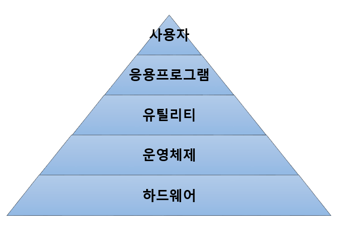

## 운영체제란?
컴퓨터 시스템의 자원들을 효율적으로 관리하고, 환경을 제공하는 여러 프로그램의 모임

## 📌 목적
1. #### 처리능력 (Throughput)
   > 일정 시간 내에 시스템이 __처리하는 일의 양__
2. #### 반환 시간 (Turn Around Time)
   > 작업을 의뢰한 시간부터 __처리가 완료돨 때까지 걸린 시간__
3. #### 사용 가능도 (Availability)
   > 시스템을 사용할 필요가 있을 때 __즉시 사용 가능한 정도__
4. #### 신뢰도 (Reliability)
   > 사스템이 주어진 문제를 __정확하게 해결하는 정도__

➡️ 운영체제의 성능을 평가하는 정도

 

## 📌 구성
### 제어 프로그램 (Control Program)
1. #### 감시 프로그램 (Supervisor Program)
   - ⭐️ 시스탬 전체의 작동 상태를 감시, 감독하는 프로그램
   - 각종 프로그램 실행
3. #### 작업 제어 프로그램 (Job Control Program)
   - ⭐️ 다른 업무로의 이행을 자동으로 수행하기 위한 준비 및 처리를 담당하는 프로그램
4. #### 자료 관리 프로그램 (Data Management Program)
   - ⭐️ 파일과 데이터를 표준적인 방법으로 처리하도록 관리하는 프로그램
   - 주기억장치(RAM, ROM)과 보조기억장치 사이의 자료 전송
   - 파일의 조작 및 처리
   - 입출력 자료와 프로그램 간의 논리적 연결  
### 처리 프로그램 (Processing Program)
1. #### 언어 번역 프로그램 (Language Translate Program)
   - 원시 프로그램을 기계어 형태의 목적 프로그램으로 번역하는 프로그램
2. #### 서비스 프로그램 (Service Program)
   - 시스템 제공자가 미리 작성하여 사용자에게 제공해주는 것
   - 사용 빈도가 높은 프로그램
3. #### 문제 프로그램 (Problem Program)
   - 특정 업무, 문재 해결을 위해 사용자가 직접 작성한 프로그램
 

## 🚖 운용 기법의 발달 과정

일괄 처리 시스템 (Batch Processing System)

- 초기의 컴퓨터 시스템 
- 일정량 또는 일정 기간 데이터를 모아서 한꺼번에 처리하는 방식

다중 프로그래밍 시스템 (Multi-Programming System)

- 하나의 CPU & 하나의 주기억장치로 여러개의 프로그램을 동시에 처리하는 방식

시분할 시스템 (Time Sharing System)

- 여러 명의 사용자가 사용하는 시스템에서 컴퓨터가 사용자들을 번갈아가며 처리해 줌 
- 각 사용자에게 독립된 컴퓨터를 사용하는 느낌 제공 
- 라운드 로빈(Round Robin) 방식

다중 처리 시스템 (Multi-Processing System)

- 여러 개의 CPU & 하나의 주기억장치로 여러개의 프로그램을 동시에 처리하는 방식

실기간 처리 시스템 (Real Time Processing System)

- 여러 명의 사용자가 사용하는 시스템에서 컴퓨터가 사용자들을 번갈아가며 처리해 줌 
- 각 사용자에게 독립된 컴퓨터를 사용하는 느낌 제공 
- 라운드 로빈(Round Robin) 방식

범용 시스템 (General Purpose System)

- 일괄 처리 시스템 + 시분할 시스템 + 다중 처리 시스템 + 실시간 처리 시스템 
- 다중 모드 처리 시스템

분산 처리 시스템 (Distributed Processing System)

- 여러 개의 컴퓨터(프로세서)를 통신 회신으로 연결하여 하나의 작업을 처리

