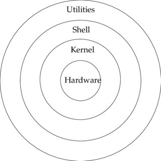

## 1. UNIX의 개요 및 특징
- 1960년대
- AT&T 벨 연구소, MIT, General Electric이 공동개발한 운영체제
- 시분할 시스템/ 대화식 운영체제/ 개방형 시스템
- 대부분 C언어로 작성, 프로세스 간 호환성 높음
- 크기가 작고 이해가 쉬움
- Multi-User, Multi-Tasking
- 통신망(Network) 관리용 운영체제로 적합
- 계층형 트리 구조의 파일 시스템
- 표준 입출력을 통해 명령어들이 파이프라인으로 연결

 

## 2. UNIX 시스템의 구성

### 커널(Kernel)
- UNIX의 핵심적인 부분
- 컴퓨터가 부팅될 때 주기억장치에 적재된 후 상주
- 하드웨어 보호, 프로그램과 하드웨어 간 인터페이스
- 프로새스 관리, 기억장치 관리, 파일 관리, 입출력 관리, 데이터 전송 및 변환

### 쉘(Shell)
- 사용자의 명령어를 인식하여 명령을 수행하는 해석기
- 명령을 해석하여 커널로 전달하는 명령 인터프리터
- 단말장치를 통해 명령어를 입력받음
- 공용 Shell 또는 직접 만든 Shell을 사용할 수 있음

### 유틸리티 프로그램(Utility Program)
- 일반 사용자가 작성한 응용 프로그램을 처리
- DOS에서 외부 명령어
- 유틸리티 프로그램에는 에디터, 컴파일러, 인터프리터, 디버거

 

## 3. LINUX의 개요 및 특정
- 1991년 리누스 토발즈가 UNIX를 기반으로 운영체제
- 개방형 시스템, 재배포 가능
- UNIX와 완벽 호환, 대부분 UNIX와 특성 동일
