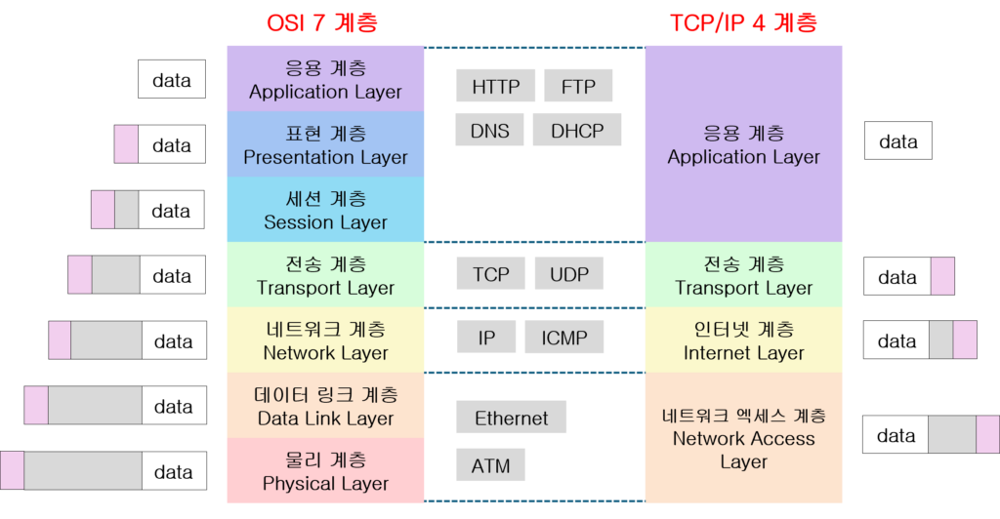

# OSI 참조 모델
## 개념
> 원환한 통신을 위해 ISO(국제표준화기구)에서 제안한 통신 규약(Protocol)
- 7단계로 규정
- 1-3계층을 하위 계층, 4-7계층을 상위 계층이라 함

## OSI 7계층

## OSI 계층별 특징
|계층|특징|표준|PDU(프로토콜 데이터 단위)|
|---|---|---|---|
|물리 계층(Physical Layer)|전송이 필요한 두 장치 간의 실제 접속과 절단 등 기계정, 전기적, 기능적, 절차적 특성 규정|RS-232C, X.21|Bit|
|데이터 링크 계층(Data Link Layer)|두 개의 인접한 개방 시스템들 간에 신뢰성 있고 효율적인 정보 전송|HDLC, ADCCP, LLC, LAPB, LAPD|Frame|
|네트워크 계층(Network Layer)|시스템들 간의 네트워크 연결을 관리하는 기능, 데이터의 교환 및 중계 기능|X.25, ARP, IPX, IP, ICMP|Packet|
|전송 계층(Transport Layer)|논리적 안정과 균일한 데이터 전송, 종단 시스템 간에 투명한 데이터 전송|TCP, UDP|Segment|
|세션 계층(Session Layer)|송수신 측 간의 관련성을 유지하고 대화 제어|-|Message|
|표현 계층(Physical Layer)|응용 계층으로부터 받은 데이터를 세션 계층에 맞는 데이터로 변환|-|Message|
|응용 계층(Physical Layer)|사용자가 OSI환경에 접근 HTTP, SMTP, FTP, TELNET|-|Message|
