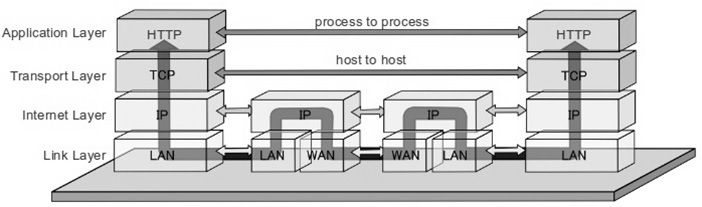

## ⏰ 프로토콜(Protocol)
> 서로 다른 기기들 간의 데이터 교환을 원활하게 수행할 수 있도록 표준화시켜놓은 통신 규약

- ### 💡 구문
  > 전송하고자 하는 **데이터의 형식, 부호화, 신호 레벨** 등을 규정
- ### 💡 의미
  > 두 기기 간의 효율적이고 정확한 정보 전송을 위한 협조 사항과 오류 관리를 위한 **제어 정보**를 규정
- ### 💡 시간
  > 두 기기 간의 통신 속도, 메시지의 순서 제어 등을 규정
- ### 🕰️ 기능
  > 단편화와 재결합, 캡슐화, 흐름 제어, 오류 제어, 동기화, 순서 제어, 주소 지정, 다중화, 경로 제어, 전송 서비스
 

## ⏰ TCP/IP(Transmission Control Protocol/Internet Protocol)
> 인터넷이 연결된 서로 다른 기종의 컴퓨터들이 데이터를 주고받을 수 있도록 하는 표준 프로토콜
 

### TCP/IP 4계층

|계층|특징|데이터 단위|예시|장비|
|---|---|---|---|---|
|응용 계층(Application Layer)|- 응용 프로그램끼리의 송수신|Data/Message|파일 전송, 이메일, FTP, HTTP, DNS, SMTP 등|-|
|전송 계층 (Transport Layer)|- 호스트끼리 송수신 - 통신 노드 간의 데이터 전송 및 흐름에 있어 신뢰성을 보장|Segment|TCP, UDP 등|게이트웨이|
|인터넷 계층 (Internet Layer)|- 데이터 전송을 위한 논리적 주소 및 경로 지정 - 서로 다른 네트워크 간의 통신을 가능하게 하는 역할을 수행|Packet|IP, ARP, ICMP, RARP 등|라우터|
|네트워크 연결 계층 (Network Acees Layer)|- 실제 데이터인 프레임 송수신 - 같은 네트워크 안에서 데이터가 전송됨|Frame|Ethernet 등|브릿지, 스위치|

|프로토콜|설명|
|---|---|
|HTTP(HyperText Transfer Protocol|하이퍼 텍스트 문서를 교환하기 위한 프로토콜|
|FTP(File Transfer Protocol)|파일 전송을 위한 프로토콜|
|TFTP(Trivial File Tran||
|Telnet(TELetype NETwork)||
|SMTP||
